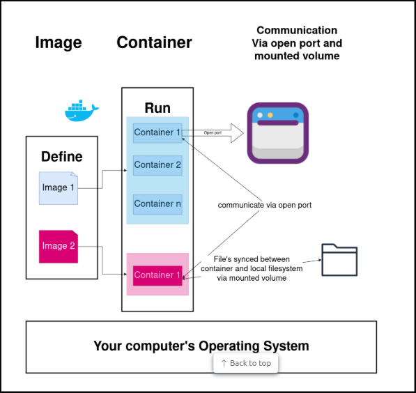

# Docker for Data Engineers

Using Docker for containerization in data projects

Blog for repo: [Docker for Data Engineers](https://www.startdataengineering.com/post/docker-for-de/)

## Prerequisites

1. Git >= 2.37.1
2. Docker >= 20.10.17 and Docker Compose >= v2.10.2
3. For **Window users**, please set up [Ubuntu on WSL](https://documentation.ubuntu.com/wsl/latest/) to use the Ubuntu terminal

## Quick Start

```bash
git clone https://github.com/ppkhai2612/docker_for_data_engineers.git
cd docker_for_data_engineers
docker compose build spark-master # build custom image based on local Dockerfile
docker compose up --build -d --scale spark-worker=2 # start containers
docker ps # list of running containers
# you can open http://localhost:9001 to see MinIO, then sign in with username=minio and password=minio123
# after sign in successfully, you can see rainforest and tpch buckets as well
docker compose down # stop containers
```

After seeing how containers run, make sense to understand fundamental Docker concepts



## Explore more

### With and without compose

Here I want to emphasize the benefits of docker compose. If you don't use compose, each time you start the application, you will have to run each container separately and managing multiple containers will be very complicated. So compose was born to solve these problems.

For example to just start `spark-master` container, we have to run verbose command in [docker-run.sh](docker-run.sh)

### Docker exec

Run `docker compose up --build -d --scale spark-worker=2` again

Using the `docker exec` command to execute command in the running container. For example, we can use the following to open a bash terminal in our `spark-master` container:

```bash
docker exec -ti spark-master bash
# Now you will be in the spark-master container bash shell
exit # exit the container
docker exec spark-master echo hello # run a command without interactive mode and get an output immediately
```

### Running a Jupyter notebook

Use the following command to start a jupyter server:

```bash
docker exec spark-master bash -c "jupyter notebook --ip=0.0.0.0 --port=3000 --allow-root"
```

You will see a link displayed with the format `http://127.0.0.1:3000/?token=your-token`, click it to open the jupyter notebook on your browser. You can use [sample_jupyter_spark_nb.ipynb](./sample_jupyter_spark_nb.ipynb) notebook to get started.

You can stop the jupyter server with `Ctrl + c`.

### Running on GitHub codespaces

**Important**: Make sure you shut down your codespace instance when not in use (see [GitHub Codespaces billing](https://github.com/features/codespaces) for more details).

You can run our data infra in a GitHub Codespace container as shown below.

1. Clone this repo, and click on `Code` -> `Codespaces` -> `Create codespace on main` in the GitHub repo page.
2. In the codespace, start the docker containers with `docker compose up --build -d`. Note that we skip the num of workers, since we don't want to tax the codespace VM.
3. Run commands as you would in your terminal.


**Note**: If you want to use Jupyter notebook via codespace to forward the port 3000, let's follow the steps in [Forwarding ports in your codespace](https://docs.github.com/en/codespaces/developing-in-a-codespace/forwarding-ports-in-your-codespace)

### Play around

```bash
# create fake upstream data
docker exec spark-master bash -c "python3 /opt/spark/work-dir/capstone/upstream_datagen/datagen.py"

# run etl
docker exec spark-master spark-submit --master spark://spark-master:7077 --deploy-mode client /opt/spark/work-dir/etl/simple_etl.py

# run tests
docker exec spark-master bash -c 'python3 -m pytest --log-cli-level info -p no:warnings -v /opt/spark/work-dir/etl/tests'
```

If you want to learn more about testing, see [How to test PySpark code with pytest](https://www.startdataengineering.com/post/test-pyspark/)
