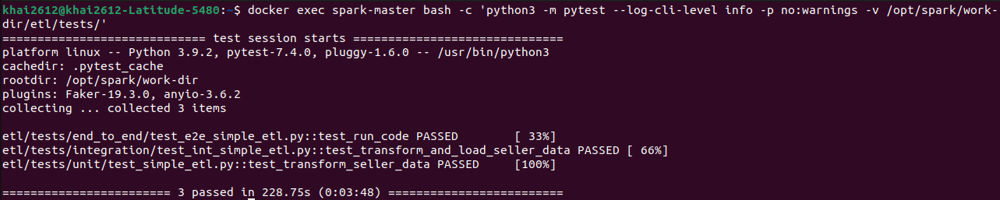

# How to test PySpark code with pytest

Implement testing for Pyspark code to ensure all code logic is working as expected

This docs is based on [How to test PySpark code with pytest](https://www.startdataengineering.com/post/test-pyspark/)

## How to run tests

You can run tests in one of two ways (the containers is running are required)

1. Bash into the docker container and then run pytest

```bash
# bash into the spark-master container with 
docker exec -ti spark-master bash
# run pytest inside the docker container 
python3 -m pytest --log-cli-level info -p no:warnings -v /opt/spark/work-dir/etl/tests
# exit docker container
exit
```

2. Run pytest inside the docker container by submitting pytest to the `spark-master` container

```bash
docker exec spark-master bash -c 'python3 -m pytest --log-cli-level info -p no:warnings -v /opt/spark/work-dir/etl/tests'
```

## The results


